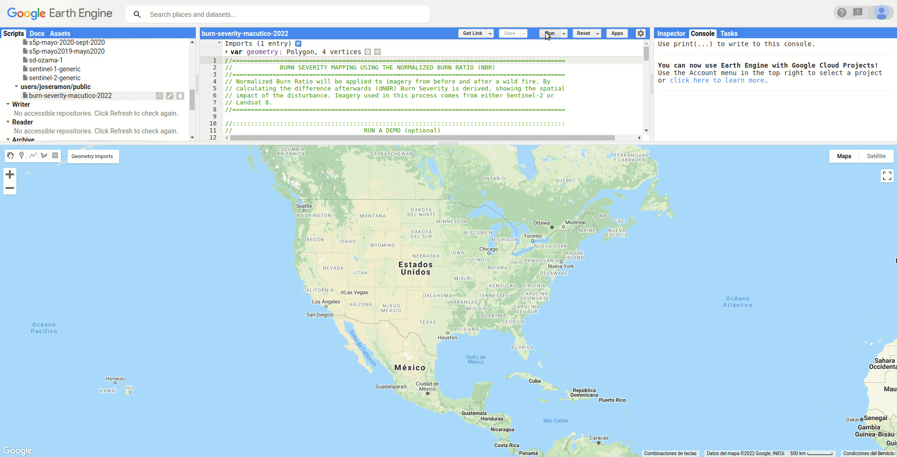
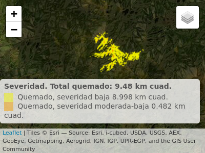

Severidad/Intensidad de quemado <br> del incendio de enero de 2022 en
Macutico, <br> Cordillera Central, República Dominicana
================
José Ramón Martínez Batlle

<!-- README.md is generated from README.Rmd. Please edit that file -->

Nota: mapa interactivo en la [versión
HTML](https://geofis.github.io/fuego-macutico-202201/README.html) de
este documento.

El 3 de enero de 2022, los sensores MODIS y VIIRS detectaron puntos de
calor sobre el área de Macutico, en el límite entre los parques
nacionales Armando Bermúdez y José del Carmen Ramírez, cordillera
Central de República Dominicana. Brigadas del Ministerio de Medio
Ambiente sofocaron el incendio. Puntos de calor estuvieron visibles
hasta, como muy tarde, el 12 de enero.

](modis-20220103.jpg)

Usando escenas Landsat 8 (prefuego, 22/dic/2021; posfuego, 23/ene/2022),
y aplicando una versión modificada del [*script* Google Earth Engine de
UN-Spider “BURN SEVERITY MAPPING USING THE NORMALIZED BURN RATIO
(NBR)”](https://un-spider.org/advisory-support/recommended-practices/recommended-practice-burn-severity/burn-severity-earth-engine),
realicé un análisis de la intensidad de quemado en dicho incendio usando
el diferencial del índice normalizado de quema (dNBR). Adapté el
*script* fuente a la colección más reciente de imágenes Landsat 8
(LANDSAT/LC08/C02/T1\_L2).



La web está repleta de recursos sobre esta técnica, recomiendo [esta
particularmente](https://un-spider.org/es/node/10959). Como resultado
del análisis aplicado a Macutico, estimé unos 9.5 km<sup>2</sup> de
superficie quemada, predominantemente de baja intensidad. A
continuación, muestro el código de análisis y visualización de R.

## Paquetes

``` r
library(raster)
## Loading required package: sp
library(leaflet)
dnbr <- raster('data/dNBR_macutico.tif')
```

## Mapa de intensidad (dNBR) generado en EarthEngine.

-   Código de EarthEngine
    [aquí](https://code.earthengine.google.com/?scriptPath=users%2Fjoseramon%2Fpublic%3Aburn-severity-macutico-2022).

-   Para aplicar a una cuenta de EarthEngine, [rellenar formulario de
    aplicación](https://signup.earthengine.google.com/#!/).

``` r
dnbr_utm <- projectRaster(dnbr, crs = CRS('EPSG:32619'))
```

## Rangos/matriz, reclasificar imagen dNBR

``` r
rangos <- c(
  -Inf, -500, -1,
  -500, -251, 1,
  -251, -101, 2,
  -101, 99, NA,
  99, 269, 4,
  269, 439, 5,
  439, 659, 6,
  659, 1300, 7,
  1300, Inf, -1) 
rclmat <- matrix(rangos, ncol = 3, byrow = TRUE)

# Reclasificar
dnbr_rcl <- reclassify(dnbr_utm, rcl = rclmat, right=NA)
```

## Tabla de atributos, leyenda, colores

``` r
# Tabla de atributos
dnbr_rcl <- ratify(dnbr_rcl)
rat <- levels(dnbr_rcl)[[1]]

# Resolucion (en km2)
resol <- res(dnbr_rcl)[1]*res(dnbr_rcl)[2]/1000000

# Etiquetas
etiq <- c('Regenerado, alta intensidad', 'Regenerado, baja intensidad', 
          'No quemado', 'Quemado, intensidad baja', 'Quemado, intensidad moderada-baja', 
          'Quemado, intensidad moderada-alta', 'Quemado, intensidad alta')
etiq_validas <- c(4, 5)

# Leyenda y colores
rat$leyenda  <- paste(etiq[etiq_validas], round(table(dnbr_rcl[])*resol, 3), 'km cuad.')
levels(dnbr_rcl) <- rat
colores <- c("yellow2", "orange2")
```

## Mapa con leaflet

-   Versión interactiva
    [aquí](https://geofis.github.io/fuego-macutico-202201/README.html)

``` r
leaflet() %>%
  addTiles(group = 'OSM') %>%
  addProviderTiles("Esri.NatGeoWorldMap", group="ESRI Mapa") %>%
  addProviderTiles("Esri.WorldImagery", group="ESRI Imagen") %>%
  addProviderTiles("CartoDB.Positron", group= "CartoDB") %>%
  addRasterImage(dnbr_rcl, colors = colores, group = 'Intensidad') %>% 
  addLayersControl(
    overlayGroups = 'Intensidad',
    baseGroups = c("ESRI Imagen", "OSM", "ESRI Mapa", "CartoDB")) %>%
  addLegend(
    title = paste(
      'Intensidad. Total quemado:',
      round(sum(table(dnbr_rcl[]))*resol, 2),
      'km cuad.'),
    pal = colorFactor(colores, rat$leyenda), values = rat$leyenda,
    labels = rat$leyenda, position = 'bottomright') %>% 
  setView(
    lat = mean(extent(dnbr)[3:4])-0.05,
    lng = mean(extent(dnbr)[1:2]), zoom=11) %>% 
  suppressWarnings()
```


